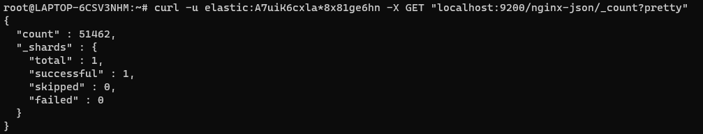
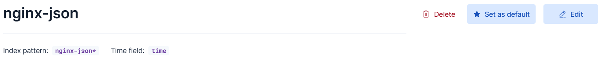
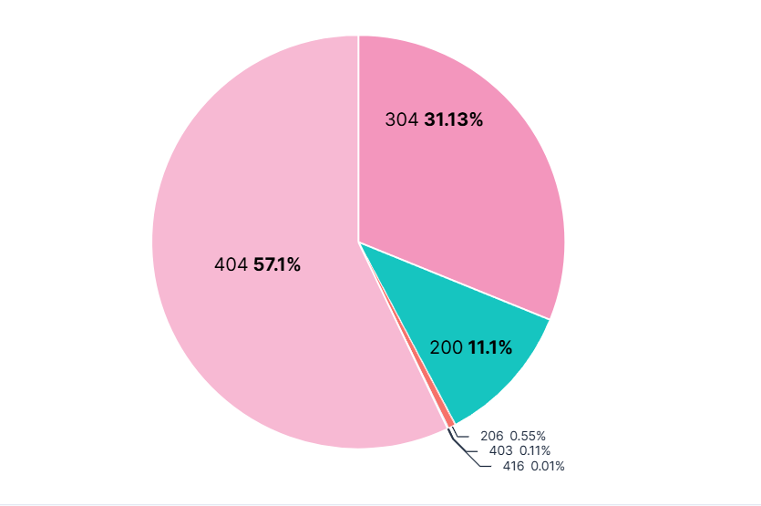
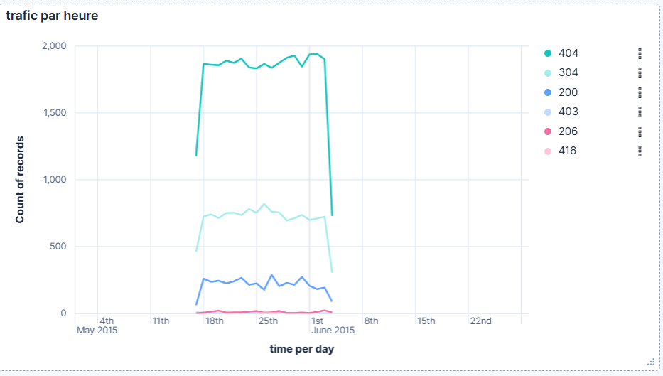
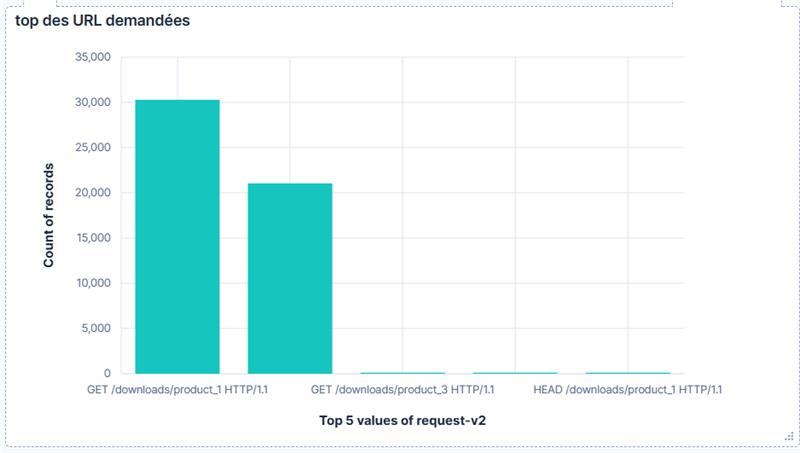
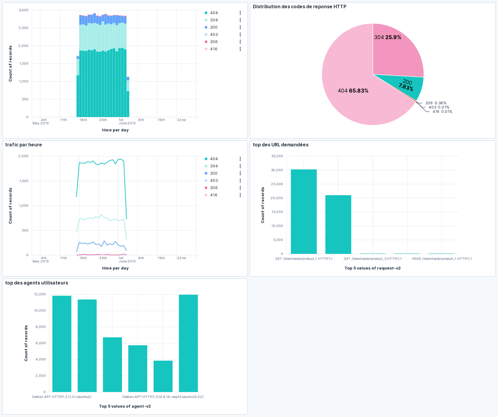

# TP : Visualisation de données avec Kibana et Elasticsearch

## Objectifs

À la fin de ce TP, vous serez capable de :
- Importer des jeux de données directement dans Elasticsearch
- Créer et configurer des Data Views dans Kibana
- Créer des visualisations avancées pour analyser des données
- Construire des dashboards interactifs
- Configurer des filtres et des variables pour personnaliser vos visualisations

## Durée (conseillée)

**2-3 heures**

## Prérequis

- Elasticsearch 7.x ou 8.x installé et fonctionnel
- Kibana 7.x ou 8.x installé et configuré pour fonctionner avec Elasticsearch
- Accès à un terminal pour exécuter les commandes `curl` ou à un client REST comme Postman
- Connaissance de base des requêtes HTTP et du format JSON

## Jeu de données

Pour ce TP, nous utiliserons des jeux de données préexistants fournis par Elastic :
- Logs NGINX - Format standard et JSON
- Sample Web Shop Data - Données e-commerce (transactions, clients, produits)
- Sample Flight Data - Données de vols (optionnel, pour aller plus loin)

Ces données seront directement importées dans Elasticsearch sans avoir besoin de Filebeat ou d'autres outils intermédiaires.

---

## Plan du TP

### Partie 1 : Importation de données dans Elasticsearch (45 min)

- Téléchargement des données depuis le référentiel Elastic
- Préparation des données pour l'indexation
- Indexation directe dans Elasticsearch
- Vérification des données importées

---

### Partie 2 : Configuration des Data Views dans Kibana (30 min)

- Création de Data Views pour les logs NGINX
- Création de Data Views pour les données e-commerce
- Exploration des données avec Discover

---

### Partie 3 : Création de visualisations avec Lens (1h15)

#### Visualisations pour les logs NGINX
- Distribution des codes de réponse HTTP
- Trafic par période de temps
- Top des URLs et des agents utilisateurs

#### Visualisations pour les données e-commerce
- Chiffre d'affaires par catégorie
- Évolution des ventes dans le temps
- Carte des clients par localisation

---

### Partie 4 : Construction de dashboards (1h)

- Dashboard d'analyse de trafic web
- Dashboard d'analyse des performances e-commerce
- Configuration de filtres et variables

---

### Partie 5 : Fonctionnalités avancées de Kibana (30 min)

- Utilisation des contrôles d'entrée (Input controls)
- Création de drilldowns pour l'exploration des données
- Exportation et partage des dashboards

## Instructions détaillées

## Partie 1 : Importation de données dans Elasticsearch

### 1.1 Téléchargement des données depuis le référentiel Elastic

```bash
# Télécharger les données NGINX au format standard
wget https://raw.githubusercontent.com/elastic/examples/master/Common%20Data%20Formats/nginx_logs/nginx_logs

# Télécharger les données NGINX au format JSON
wget https://raw.githubusercontent.com/elastic/examples/master/Common%20Data%20Formats/nginx_json_logs/nginx_json_logs

```

Alternative : Utiliser des données de sample directement fournies par Kibana
Si vous préférez ne pas télécharger de données externes, Kibana propose des jeux de données de
démonstration que vous pouvez facilement charger :
. Ouvrir Kibana dans votre navigateur (http://localhost:5601)
. Aller dans la page d accueil
. Cliquer sur "Add sample data"
. Choisir "Sample eCommerce orders" et/ou "Sample web logs"
. Cliquer sur "Add data"

### 1.2 Indexation directe des données NGINX dans Elasticsearch

Si vous avez téléchargé les données, nous allons maintenant les indexer dans Elasticsearch :
Préparation des données NGINX standard

#### Créer l'index pour les logs NGINX

curl -X PUT "localhost:9200/nginx-logs?pretty"

**✅ Réponses/Validation d'étape :**  
{  
    "acknowledged": true,  
    "shards_acknowledged": true,  
    "index": "nginx-logs"  
}

#### Créer un script pour convertir les logs au format combiné en JSON

cat > convert_nginx_logs.sh << 'EOF'
#!/bin/bash
while read line; do
 if [[ $line =~ ^([0-9]+\.[0-9]+\.[0-9]+\.[0-9]+)\ -\ ([^\ ]+)\ \
[([^]]+)\]\ \"([^\ ]+)\ ([^\ ]+)\ ([^"]+)\"\ ([0-9]+)\ ([0-9]+)\ \"
([^"]+)\"\ \"([^"]+)\" ]]; then
 IP="${BASH_REMATCH[1]}"
 USER="${BASH_REMATCH[2]}"
 TIMESTAMP="${BASH_REMATCH[3]}"
 METHOD="${BASH_REMATCH[4]}"
 PATH="${BASH_REMATCH[5]}"
 PROTOCOL="${BASH_REMATCH[6]}"
 STATUS="${BASH_REMATCH[7]}"
 SIZE="${BASH_REMATCH[8]}"
 REFERER="${BASH_REMATCH[9]}"
 USER_AGENT="${BASH_REMATCH[10]}"

 ISO_TIMESTAMP=$(date -d "${TIMESTAMP}" -u +"%Y-%m-%dT%H:%M:%S.000Z"
2>/dev/null || date -j -f "%d/%b/%Y:%H:%M:%S %z" "${TIMESTAMP}" "+%Y-%m-
%dT%H:%M:%S.000Z" 2>/dev/null)

 echo "{\"index\":{\"_index\":\"nginx-logs\"}}"
 echo "
{\"@timestamp\":\"${ISO_TIMESTAMP}\",\"client_ip\":\"${IP}\",\"user\":\"${
USER}\",\"method\":\"${METHOD}\",\"path\":\"${PATH}\",\"protocol\":\"${PRO
TOCOL}\",\"response\":${STATUS},\"bytes\":${SIZE},\"referer\":\"${REFERER}
\",\"user_agent\":\"${USER_AGENT}\"}"
 fi
done < "$1"
EOF
chmod +x convert_nginx_logs.sh

#### Convertir les logs et les indexer dans Elasticsearch

./convert_nginx_logs.sh nginx_logs > nginx_logs_bulk.json
curl -H "Content-Type: application/x-ndjson" -X POST
"localhost:9200/_bulk?pretty" --data-binary @nginx_logs_bulk.json

Indexation des données NGINX JSON

#### Créer l'index pour les logs NGINX JSON

curl -X PUT "localhost:9200/nginx-json?pretty"

#### Préparer les logs JSON pour l'indexation en bulk

cat > prepare_nginx_json.sh << 'EOF'
#!/bin/bash
while read line; do
 echo "{\"index\":{\"_index\":\"nginx-json\"}}"
 echo "$line"
done < "$1"
EOF
chmod +x prepare_nginx_json.sh

#### Convertir les logs et les indexer dans Elasticsearch

./prepare_nginx_json.sh nginx_json_logs > nginx_json_bulk.json
curl -H "Content-Type: application/x-ndjson" -X POST
"localhost:9200/_bulk?pretty" --data-binary @nginx_json_bulk.json

### 1.3 Vérification des données importées

#### Vérifier le nombre de documents dans l'index nginx-logs

curl -X GET "localhost:9200/nginx-logs/_count?pretty"

#### Vérifier le nombre de documents dans l'index nginx-json

curl -X GET "localhost:9200/nginx-json/_count?pretty"

**✅ Réponses/Validation d'étape :**  


#### Examiner la structure d'un document

curl -X GET "localhost:9200/nginx-logs/_search?pretty&size=1"

## Partie 2 : Configuration des Data Views dans Kibana

### 2.1 Création de Data Views pour les logs NGINX

- Ouvrez Kibana dans votre navigateur : `http://localhost:5601`
- Accédez à **Stack Management > Data Views**
- Cliquez sur **Create data view**

**Configurer un Data View pour les logs NGINX standard :**
- **Name** : `nginx-logs`
- **Index pattern** : `nginx-logs`
- **Time field** : `@timestamp`
- Cliquez sur **Save data view to Kibana**

**Créer un autre Data View pour les logs NGINX JSON :**
- **Name** : `nginx-json`
- **Index pattern** : `nginx-json`
- **Time field** : `@timestamp`
- Cliquez sur **Save data view to Kibana`

**✅ Réponses/Validation d'étape :**  


### 2.2 Création de Data Views pour les données e-commerce (si vous avez utilisé les sample data de Kibana)

- Accédez à **Stack Management > Data Views**
- Cliquez sur **Create data view**

**Configurer un Data View pour les données e-commerce :**
- **Name** : `ecommerce`
- **Index pattern** : `kibana_sample_data_ecommerce`
- **Time field** : `order_date`
- Cliquez sur **Save data view to Kibana**

---

### 2.3 Exploration des données avec Discover

- Accédez à **Discover**
- Sélectionnez le Data View `nginx-logs` ou `nginx-json`
- Ajustez la période temporelle pour voir tous les logs
- Explorez les différents champs disponibles :
  - `client_ip` (ou équivalent)
  - `response`
  - `path`
  - `user_agent`

**Essayez quelques requêtes simples :**
- `response:404` (pour trouver les erreurs 404)
- `path:*.php` (pour trouver les requêtes vers des fichiers PHP)
- `user_agent:*Chrome*` (pour trouver les navigateurs Chrome)

- Répétez le même processus avec le Data View `ecommerce` si vous avez importé ces données.

## Partie 3 : Création de visualisations avec Lens

### 3.1 Visualisations pour les logs NGINX

#### Visualisation 1 : Distribution des codes de réponse HTTP

- Accédez à **Visualize Library > Create visualization**
- Sélectionnez **Lens**
- Sélectionnez le Data View `nginx-logs` ou `nginx-json`
- Créez un graphique en **camembert (Pie)** :
  - Glissez-déposez le champ `response` dans la zone de visualisation
  - Assurez-vous que l'agrégation est définie sur **Terms**
  - Réglez "Top values" sur **10**
- Sauvegardez sous le nom **"HTTP Response Codes Distribution"**

**✅ Réponses/Validation d'étape :**  
Le filtre Terms n'étant pas disponible dans notre cas impossible de le mettre en place. Néanmoins nous avons tout de même réalisé un graphique en camembert des codes de réponse HTTP relevés :  


#### Visualisation 2 : Trafic par heure

- Créez une nouvelle visualisation avec **Lens**
- Sélectionnez le Data View `nginx-logs` ou `nginx-json`
- Créez un graphique **linéaire (Line)** :
  - **Axe X** : `@timestamp` avec agrégation **Date Histogram** (intervalle : Hourly)
  - **Axe Y** : **Count**
- Sauvegardez sous le nom **"Hourly Web Traffic"**

**✅ Réponses/Validation d'étape :**  
Nous avons réalisé un graphique en bar des codes de réponse HTTP relevés :  


#### Visualisation 3 : Top des URLs demandées

- Créez une nouvelle visualisation avec **Lens**
- Sélectionnez le Data View `nginx-logs` ou `nginx-json`
- Créez un graphique **à barres horizontales (Horizontal bar)** :
  - **Axe Y** : `path` avec agrégation **Terms (Top 10)**
  - **Axe X** : **Count**
- Sauvegardez sous le nom **"Top Requested URLs"**

**✅ Réponses/Validation d'étape :**  
Nous avons réalisé un graphique en ligne des URLs :  


#### Visualisation 4 : Top des agents utilisateurs (navigateurs)

- Créez une nouvelle visualisation avec **Lens**
- Sélectionnez le Data View `nginx-logs` ou `nginx-json`
- Créez un **nuage de mots (Tag cloud)** :
  - Glissez-déposez le champ `user_agent` sur la zone de visualisation
  - Changez le type de visualisation pour **Tag cloud**
  - Assurez-vous que l'agrégation est définie sur **Terms**
  - Réglez "Top values" sur **10**
- Sauvegardez sous le nom **"Top User Agents"**

---

### 3.2 Visualisations pour les données e-commerce (si disponibles)

#### Visualisation 1 : Chiffre d'affaires par catégorie

- Créez une nouvelle visualisation avec **Lens**
- Sélectionnez le Data View `ecommerce`
- Créez un graphique **en barres verticales (Bar)** :
  - **Axe X** : `category` avec agrégation **Terms (Top 10)**
  - **Axe Y** : `taxful_total_price` avec agrégation **Sum**
- Sauvegardez sous le nom **"Revenue by Category"**

#### Visualisation 2 : Évolution des ventes dans le temps

- Créez une nouvelle visualisation avec **Lens**
- Sélectionnez le Data View `ecommerce`
- Créez un graphique **linéaire (Line)** :
  - **Axe X** : `order_date` avec agrégation **Date Histogram (intervalle : Daily)**
  - **Axe Y** : `taxful_total_price` avec agrégation **Sum**
- Sauvegardez sous le nom **"Daily Sales Trend"**

#### Visualisation 3 : Carte des clients par pays

- Créez une nouvelle visualisation avec **Maps**
- Ajoutez une couche via **Add layer > Documents**
- Sélectionnez le Data View `ecommerce`
- Choisissez **Grid aggregation** comme type de couche

**Configurez la couche :**
- **Metric** : Count
- **Symbologie** : Grid
- **Coloration** : Gradient

- Sauvegardez sous le nom **"Customer Locations"**

**✅ Réponses/Validation d'étape :**  
Nous avons réalisé un graphique en ligne des URLs :  


## Partie 4 : Construction de dashboards

### 4.1 Dashboard d'analyse de trafic web

- Accédez à **Dashboard > Create dashboard**
- Ajoutez les visualisations créées précédemment :
  - **"HTTP Response Codes Distribution"**
  - **"Hourly Web Traffic"**
  - **"Top Requested URLs"**
  - **"Top User Agents"**
- Organisez le dashboard en redimensionnant et en déplaçant les visualisations
- Ajoutez un titre au dashboard : **"Web Traffic Analysis"**
- Sauvegardez le dashboard

---

### 4.2 Dashboard d'analyse des performances e-commerce (si les données sont disponibles)

- Créez un **nouveau dashboard**
- Ajoutez les visualisations créées précédemment :
  - **"Revenue by Category"**
  - **"Daily Sales Trend"**
  - **"Customer Locations"**
- Ajoutez une visualisation métrique pour le chiffre d'affaires total :
  - Créez une nouvelle visualisation **directement depuis le dashboard**
  - **Type** : Metric
  - **Agrégation** : Sum de `taxful_total_price`
- Organisez le dashboard en redimensionnant et en déplaçant les visualisations
- Ajoutez un titre au dashboard : **"E-commerce Performance Analysis"**
- Sauvegardez le dashboard

---

### 4.3 Configuration de filtres et variables

#### Pour le dashboard de trafic web :
- Ajoutez des filtres globaux :
  - **Filtre par code de réponse** : `response: 200`
  - **Filtre par type de navigateur** : `user_agent: Chrome`

#### Pour le dashboard e-commerce (si disponible) :
- **Filtre par catégorie**
- **Filtre par pays**

- Configurez le **sélecteur de temps** en haut du dashboard pour permettre une sélection facile de la période d'analyse

## Partie 5 : Fonctionnalités avancées de Kibana

### 5.1 Utilisation des contrôles d'entrée (Input controls)

- Accédez à votre **dashboard de trafic web**
- Cliquez sur **Edit**
- Cliquez sur **Add > Controls > Options list**

**Configurer un contrôle pour le champ "response"** :
- **Type** : Options list
- **Data view** : `nginx-logs` ou `nginx-json`
- **Field** : `response`
- **Label** : "HTTP Status Code"

**Ajouter un autre contrôle pour le type de fichier demandé (extension)** :
- **Type** : Options list
- **Data view** : `nginx-logs` ou `nginx-json`
- **Field** : `path.keyword` *(avec un script pour extraire l'extension)*
- **Label** : "File Type"

- Sauvegardez le dashboard

---

### 5.2 Création de drilldowns pour l'exploration des données

- Éditez la visualisation **"Top Requested URLs"**
- Configurez un drilldown :
  - Cliquez sur **Actions**
  - Sélectionnez **Create drilldown**
  - **Type** : Dashboard drilldown
  - Sélectionnez le dashboard **"Web Traffic Analysis"**
  - Configurez un filtre basé sur la valeur de l’URL cliquée

- Sauvegardez la visualisation et le dashboard

---

### 5.3 Exportation et partage des dashboards

- Ouvrez le dashboard que vous souhaitez partager
- Cliquez sur **Share**
- Explorez les différentes options :
  - **Share this link** : Génère un lien URL direct
  - **Embed code** : Génère un code HTML pour intégrer le dashboard dans une page web
  - **Generate short URL** : Crée une URL courte *(si configuré)*
  - **Download as PNG** : Télécharge une image du dashboard
  - **Download as PDF** : Télécharge un PDF du dashboard *(version payante)*

- **Testez l’exportation du dashboard au format PNG**

---

## Exercices supplémentaires (si le temps le permet)

### 1. Création d'une visualisation TSVB (Time Series Visual Builder)

- Accédez à **Visualize Library > Create visualization**
- Sélectionnez **TSVB**
- Sélectionnez le Data View `nginx-logs` ou `nginx-json`

**Créer un graphique de série temporelle montrant le trafic web par code de statut** :
- **Panel type** : Time Series
- **Metrics** : Count, séparé par le champ `response`
- **Options** : Activez **stacking**

- Sauvegardez sous le nom **"Traffic by Status Code Over Time"**

---

### 2. Création de visualisations avec Vega

- Accédez à **Visualize Library > Create visualization**
- Sélectionnez **Vega**
- Copiez et adaptez un exemple de visualisation Vega à vos données
- Sauvegardez la visualisation

---

### 3. Création d'une présentation avec Canvas

- Accédez à **Canvas**
- Créez une **nouvelle présentation**
- Ajoutez des éléments visuels comme des jauges, graphiques et compteurs
- Personnalisez l’apparence pour un affichage en salle de contrôle

## Ressources complémentaires

- [Documentation Kibana Lens](https://www.elastic.co/guide/en/kibana/current/lens.html)
- [Documentation Kibana Dashboards](https://www.elastic.co/guide/en/kibana/current/dashboard.html)
- [Documentation TSVB (Time Series Visual Builder)](https://www.elastic.co/guide/en/kibana/current/tsvb.html)
- [Documentation Vega dans Kibana](https://www.elastic.co/guide/en/kibana/current/vega.html)
- [Documentation Canvas](https://www.elastic.co/guide/en/kibana/current/canvas.html)
- [Repository d'exemples Elastic](https://github.com/elastic/examples)

## Conclusion

Ce TP vous a permis d'explorer les fonctionnalités de visualisation et d'analyse de **Kibana** en utilisant des données directement importées dans **Elasticsearch**. Vous avez appris à :

- Importer des données dans Elasticsearch sans utiliser Filebeat
- Créer des Data Views pour accéder à vos données
- Construire diverses visualisations avec **Lens**
- Assembler des **dashboards interactifs**
- Utiliser des fonctionnalités avancées comme les **contrôles d'entrée** et les **drilldowns**

Ces compétences vous permettront de créer des visualisations efficaces pour :
- l’analyse de **logs**,
- de **données métier**,
- de **métriques**,

et de construire des **tableaux de bord interactifs** qui répondent à vos besoins spécifiques.

---

N'hésitez pas à me solliciter et à me poser un maximum de questions.  
**Le but de ce TP est de vous rendre autonome sur Kibana et Elasticsearch, pas d'arriver à tout prix au bout du TP.**

Et j’espère que **vous lisez les sujets jusqu’au bout...**  
**mnbd**