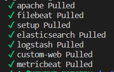
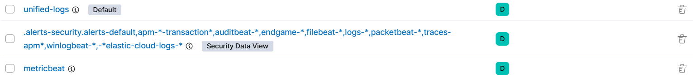
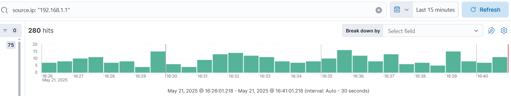
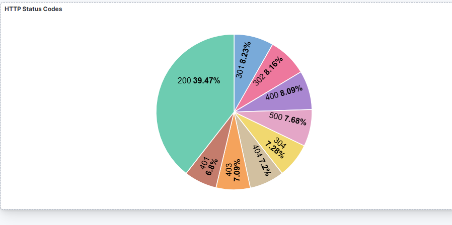
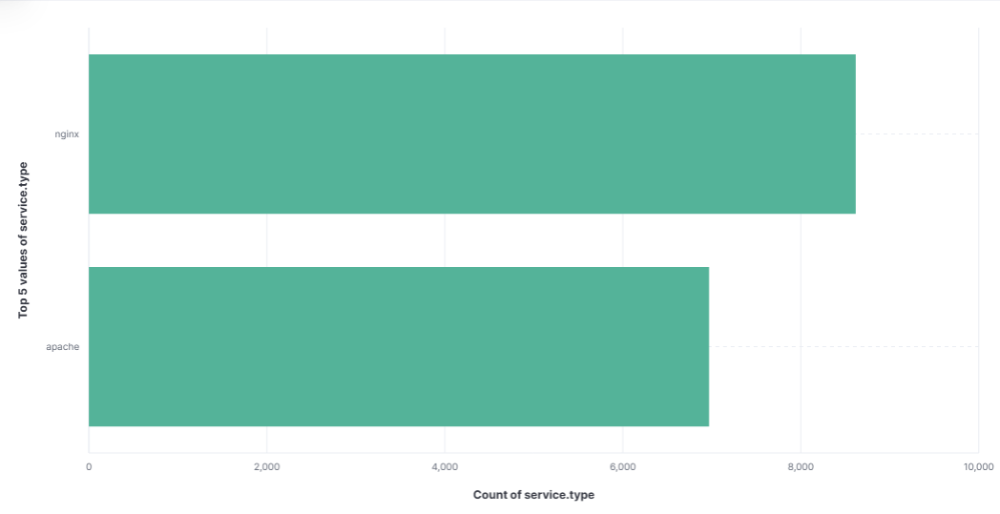
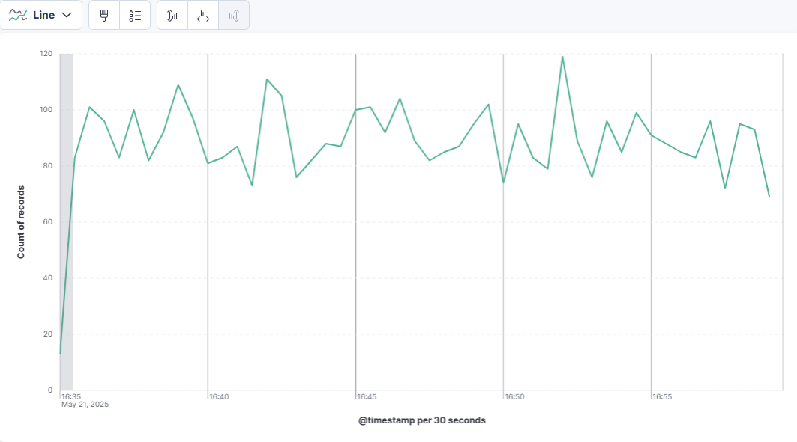
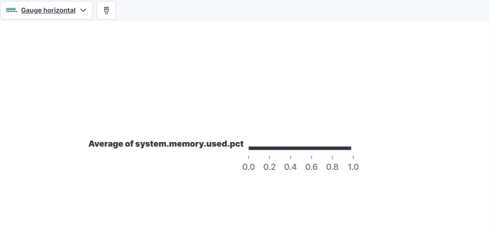
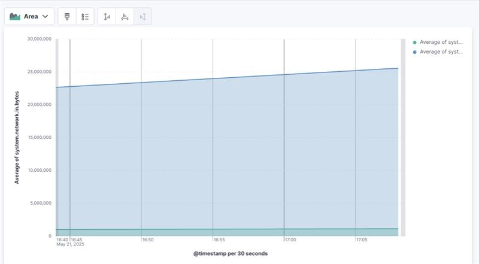

# 📦 TP3

## ETAPE 1 : Mise en place d’une architecture de génération de logs avec Docker

Cette première partie du TP a consisté à simuler une infrastructure web composée de plusieurs serveurs, chacun générant des logs dans un format différent, en préparation d’une future ingestion avec l’ELK Stack.

### 🎯 Objectifs atteints

- Déployer trois serveurs web avec Docker :
  - 🔵 Un serveur **Apache**
  - 🟢 Un serveur **Nginx**
  - 🟣 Un serveur personnalisé (Node.js) générant des **logs en JSON**
- Utiliser `docker-compose` pour orchestrer les conteneurs
- Monter des **volumes** locaux pour stocker les fichiers de logs produits
- Générer des logs côté client avec `curl` ou navigateur
- Vérifier les fichiers de logs localement dans `./logs/`

### 🗂️ Arborescence du projet

TP3/  
├── apache/ # Dockerfile Apache  
├── nginx/ # Dockerfile Nginx  
├── custom-web/ # Dockerfile + app.js Node.js  
├── logs/ # Volumes montés pour accéder aux logs  
│ ├── apache/  
│ ├── nginx/  
│ └── custom/  
├── docker-compose.yml  
└── readmeTP3.md  

### ⚙️ Fonctionnement

- Chaque conteneur expose un port :
  - Apache : `http://localhost:8081`
  - Nginx : `http://localhost:8082`
  - Custom : `http://localhost:8083`
- Les logs sont générés automatiquement à chaque requête
- Les fichiers de logs sont disponibles dans le dossier `logs/` ainsi que dans Docker Desktop (stdout) 🔧 *Possibilité d'ajouter une config `httpd.conf` personnalisée pour écrire les logs apache sur disque si besoin.*

### ✅ Statut

Environnement fonctionnel et prêt à être connecté à :
- **Filebeat**
- **Logstash**
- ou **Elasticsearch directement**  

## ETAPE 2 : Unification de logs de serveurs web dans Elastic Stack

### 🎯 Objectifs

À la fin de ce TP, vous serez capable de :
- Mettre en place un environnement Elastic Stack complet localement
- Configurer Filebeat pour collecter des logs de différents serveurs web
- Créer une pipeline Logstash pour normaliser et enrichir les logs
- Configurer une Ingest Pipeline dans Elasticsearch
- Configurer Metricbeat pour collecter des métriques système
- Explorer les données unifiées dans Kibana
- Créer des dashboards pour visualiser logs et métriques

### 🛠️ Prérequis

- Docker & Docker Compose installés
- 4 GB de RAM minimum
- Terminal et éditeur de texte
- Architecture supportée (x86_64 ou ARM64)

### ⏱️ Durée estimée

3 à 4 heures

---

### 🗂️ Architecture cible

Apache Nginx Custom Web  
│ │ │  
└───┬──────┴─────┬──────┘  
│ │  
┌───▼───┐ ┌───▼───┐  
│Filebeat│ │Metricbeat│  
└───┬───┘ └────┬────┘  
│ │  
┌─▼─────────────▼─┐  
│ Logstash │  
└──────┬──────────┘  
│  
┌────▼─────┐  
│Elasticsearch│  
└────┬─────┘  
│  
┌────▼───┐  
│ Kibana │  
└────────┘  

---

### 🔧 Plan du TP

#### 1. Mise en place de l’environnement
- Création d’un fichier `docker-compose.yml` pour déployer :
  - Elasticsearch, Kibana, Logstash, Filebeat, Metricbeat
  - Trois serveurs de logs (Apache, Nginx, Custom Web)

#### 2. Génération de logs simulés
- Fichiers `log-generator.sh` configurés pour chaque serveur
- `httpd.conf` pour Apache et `nginx.conf` pour Nginx

#### 3. Configuration de Filebeat
- Activation des modules Apache et Nginx
- Fichier `filebeat.yml` pour déclarer les inputs et l’output vers Logstash

#### 4. Configuration de Metricbeat
- Module `system` pour collecter CPU, mémoire, I/O, etc.
- Module `docker` pour observer l'activité des conteneurs

#### 5. Configuration de Logstash
- Pipeline `unified-logs.conf` pour mapper et enrichir les logs (mutate, ruby, geoip, user_agent…)

#### 6. Ingest Pipeline Elasticsearch
- Script `setup-ingest-pipeline.sh` exécuté via conteneur `curl`
- Création d’un index template pour les logs enrichis

#### 7. Lancement & vérification
- Commande :
  ```bash
  docker-compose up -d

**✅ Réponses/Validation d'étape :**  



Accès à Kibana : http://localhost:5601

Création de Data Views pour unified-logs-* et metricbeat-*

**✅ Réponses/Validation d'étape :**  

J'ai réalisé les data_views :  


J'ai réalisé différentes requêtes pour filtrer les logs :  


#### 8. Création de dashboards  

Nous avons réalisé différents tests et manipulations (voir screenshots ci-dessous).  

Dashboard Logs unifiés HTTP Status Codes (Pie Chart)

**✅ Réponses/Validation d'étape :**  



Activity by Server (Bar horizontal)

**✅ Réponses/Validation d'étape :**  



Traffic Over Time (Line chart par méthode HTTP)

**✅ Réponses/Validation d'étape :**  



Visitor Map (Map géo IP)
**✅**  

Top Pages (Tableau des URLs les plus accédées)
**✅**  

Dashboard Métriques
**✅**  

CPU Usage (Line chart)

**✅ Réponses/Validation d'étape :**  


Memory Usage (Gauge)

**✅ Réponses/Validation d'étape :**  



Network Activity (Area chart IN/OUT)

**✅ Réponses/Validation d'étape :**  



#### 9. Extensions avancées (optionnelles)
Création d’alertes sur erreurs 5xx, CPU élevé…

Intégration Machine Learning (si licence)

Intégration APM

#### 10. Nettoyage

docker-compose down -v
🧪 Résolution de problèmes
Problème	Solution
Elasticsearch ne démarre pas	Baisser ES_JAVA_OPTS à -Xms256m -Xmx256m
Logs non visibles dans Kibana	Vérifier Filebeat et Logstash (docker logs ...)
Métriques absentes	Vérifier Metricbeat et sa configuration Docker

### ✅ Conclusion
Au terme de ce TP, vous avez :

Déployé l’Elastic Stack complet avec Docker

Collecté et enrichi des logs simulés de 3 serveurs

Créé des pipelines de traitement normalisé avec Logstash

Configuré des dashboards avancés dans Kibana

Vous avez maintenant une base solide pour la supervision de systèmes distribués avec Elastic Stack.
Pour aller plus loin :

Explorez KQL (Kibana Query Language)

Ajoutez d’autres sources de logs (DB, pare-feu…)

Mettez en place des alertes, rôles utilisateurs, et dashboard en production

## Etape 3 : Comparaison des principales différences avec correction

Diff 1 : Nous avons bypassé l'étape logstash.  
Diff 2 : Ce qu'on a fait dans le pipeline de logstash (unified-log) à été fait directement dans le docker-compose dans la correction.  